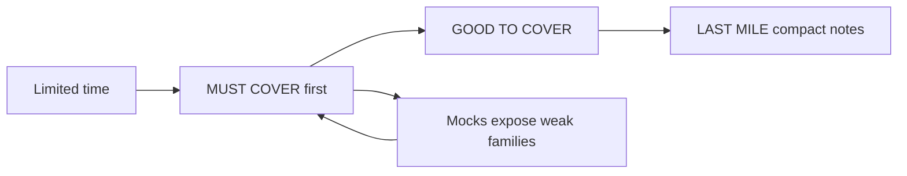
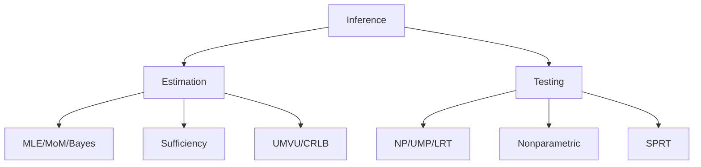
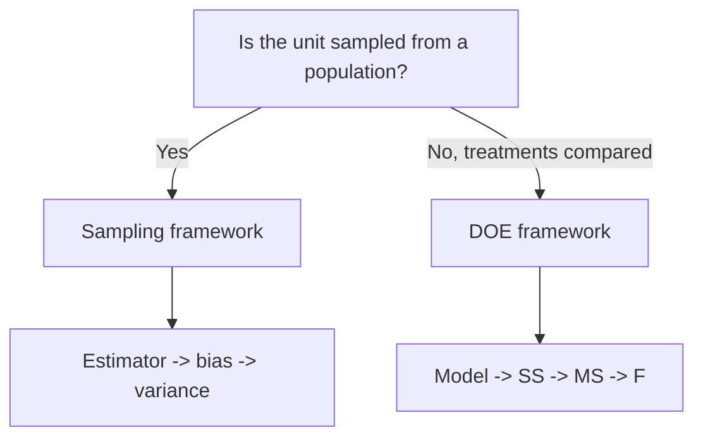
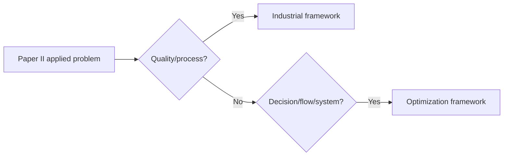

# UPSC Statistics Optional Master Guide

This guide is built from the syllabus in `Syllabus CSE statistics.pdf`, with `pyq.csv` used only as a supporting pattern signal. The purpose is simple: study what matters most, understand how each topic is asked, and practise mixed full-paper simulations.

## What To Cover First

The syllabus is large. A human plan needs priority. Use these three shelves:

### MUST COVER

These are high-return areas: frequent, central to the syllabus, and answerable through repeatable frameworks.

| Area | Why it is must-cover | Core question families |
|---|---|---|
| Statistical Inference | Repeated, concept-heavy, and decisive in Paper I | MLE, sufficiency, UMVU, CRLB, NP lemma, UMP, LRT, SPRT |
| Probability | Foundation for inference and direct scoring | Joint distributions, conditional expectation, moments, transforms, convergence, CLT |
| Optimization Techniques | Most dependable Paper II engine | LP, simplex, duality, transportation, assignment, games, Markov chains, queues |
| Industrial Statistics | Highly template-based | Control charts, acceptance sampling, OC/ASN/AOQ/ATI, reliability |
| Quantitative Economics | Formula plus interpretation repeats | Index numbers, time series, ARIMA, OLS/GLS, heteroscedasticity, autocorrelation, identification |
| Sampling Theory | Finite derivation set | SRS, stratified, ratio/regression, PPS, HT estimator |
| Design of Experiments | Table-based scoring | CRD, RBD, LSD, BIBD, factorial, confounding, missing plot |
| Demography | Formula-heavy and repeated | Vital rates, fertility, life tables, logistic curve, population projection |
| Multivariate Analysis | Compact and technical | MVN, conditional MVN, PCA, Hotelling T2, Mahalanobis D2 |

### GOOD TO COVER

These protect your score once must-cover topics are stable.

- Linear inference beyond basics: estimability, variance/covariance components, orthogonal polynomials.
- Nonparametric inference: sign, signed-rank, KS, run, median, Wilcoxon-Mann-Whitney.
- Bayesian and minimax estimation: prior/posterior, loss, risk, Bayes estimator, minimax.
- Advanced sampling: two-phase, cluster, systematic, multistage, non-negative variance for HT.
- DOE smaller designs: split-plot, simple lattice, transformation of data, Duncan multiple range test.
- Industrial smaller areas: Dodge-Romig tables, variable sampling plans, renewal density/function, CUSUM.
- OR smaller areas: simulation, Monte Carlo, replacement, storage/dam models, software packages.

### LAST MILE

These should be compact notes, not endless study holes.

- Official Statistics: agencies, publications, reliability, limitations.
- Psychometry: standard scores, IQ, validity/reliability, Spearman-Brown, factor/path analysis.
- Definitions and comparisons across applied topics.



## Resource Stack

### Use What You Already Have

- Use your Gupta books as the primary working source for most syllabus areas where they give exam-style treatment and solved examples.
- Use Cochran notes as the primary source for Sampling Theory.
- Use PYQs and the mock files here to convert reading into exam practice.

### Where Gupta Is Enough

- Probability basics and standard distributions.
- Statistical inference up to common estimation and testing patterns.
- Linear models, regression, and basic ANOVA.
- Operations Research basics: LP, transportation, assignment, games, queues, inventory.
- Demography and psychometry if your edition includes concise formula coverage.

### Where Gupta May Be Weak

- Sampling Theory depth: rely on Cochran notes.
- DOE nuance: BIBD, confounding, missing plots, split-plot, lattice.
- Industrial Statistics: control-chart constants, acceptance sampling curves, reliability/life testing.
- Econometrics/time series: ARIMA, identification, diagnostics language.
- Official Statistics: requires current agency/publication notes, not a textbook.

### Minimal Gap-Fill Sources

| Gap | Use |
|---|---|
| Sampling Theory | Cochran notes |
| DOE | Short notes from Das and Giri or selected Montgomery examples only when Gupta is thin |
| Industrial Statistics | Focused quality-control notes; Montgomery only for chart/sampling-plan clarification |
| Econometrics | Gujarati for OLS/GLS, multicollinearity, autocorrelation, heteroscedasticity, identification |
| Official Statistics | MoSPI, Census/SRS, RBI, NFHS, Labour Bureau, DGCI&S summary tables |

Resource rule: one main source, one gap-fill source, then questions. More reading is not the same as more marks.

## Study Mindset

Statistics optional is a recognition game. A question is usually asking you to:

1. Derive a known result.
2. Apply a known estimator, test, model, or design.
3. Compute a standard statistic.
4. Interpret an applied statistical procedure.
5. Combine two nearby syllabus ideas.


Before writing, ask:

- What is fixed and what is random?
- Is this estimation, testing, modeling, optimization, sampling, design, or interpretation?
- Which standard theorem/formula is being triggered?
- What conclusion should the examiner see?

## MECE Topic Map

| Block | Core skill | Main families | Question bank |
|---|---|---|---|
| Probability | Model randomness | Joint distributions, moments, transforms, convergence, CLT | [Probability](question_bank/01_probability.md) |
| Statistical Inference | Learn from samples | Estimation, sufficiency, UMVU, tests, SPRT | [Inference](question_bank/02_statistical_inference.md) |
| Linear Inference | Fit linear structures | Least squares, Gauss-Markoff, regression, ANOVA | [Linear + Multivariate](question_bank/03_linear_multivariate.md) |
| Multivariate Analysis | Handle vector data | MVN, conditional distribution, D2, T2, PCA | [Linear + Multivariate](question_bank/03_linear_multivariate.md) |
| Sampling Theory | Estimate finite population quantities | SRS, stratified, PPS, ratio/regression, HT | [Sampling](question_bank/04_sampling_theory.md) |
| Design of Experiments | Compare treatments | CRD, RBD, LSD, BIBD, factorial, confounding | [DOE](question_bank/05_design_of_experiments.md) |
| Industrial Statistics | Control quality and reliability | Charts, sampling plans, reliability, life testing | [Industrial](question_bank/06_industrial_statistics.md) |
| Optimization Techniques | Choose best action | LP, duality, transportation, games, inventory, queues | [Optimization](question_bank/07_optimization_techniques.md) |
| Quantitative Economics | Model economic data | Time series, index numbers, OLS/GLS, diagnostics | [Quant Eco](question_bank/08_quantitative_economics.md) |
| Official Statistics | Know data institutions | Agencies, publications, reliability, limitations | [Official](question_bank/10_official_statistics.md) |
| Demography | Measure population processes | Vital rates, fertility, life tables, projection | [Demography + Psychometry](question_bank/09_demography_psychometry.md) |
| Psychometry | Measure psychological attributes | Scores, IQ, validity, reliability | [Demography + Psychometry](question_bank/09_demography_psychometry.md) |

## Topic Frameworks

### Probability

What it is really about: turning uncertainty into distributions and using those distributions to compute probabilities, moments, and limits.

How UPSC asks it:

- Direct density/pmf calculations.
- Conditional expectation and conditional variance.
- MGF/PGF/CF identification.
- Transformation of variables.
- Convergence and CLT proofs/applications.

Recognition triggers:

- `joint pdf`, `marginal`, `conditional`: draw support first.
- `distribution of Y=g(X)`: use CDF if branches exist.
- `limiting distribution`: standardize and look for CLT.
- `consistent`: use WLLN/Chebyshev.

Default route:


Must-cover families: joint distributions, conditional expectation, moments, transforms, inequalities, WLLN/SLLN/CLT, standard distributions.

Good-to-cover families: inversion theorem, vector random variables, almost sure/path mean distinctions.

Common mistakes: wrong support, integrating in the wrong order, treating uncorrelated as independent without conditions, forgetting continuity correction.

### Statistical Inference

What it is really about: deciding what sample data says about an unknown parameter.

How UPSC asks it:

- Find an estimator.
- Prove estimator properties.
- Find sufficient/complete statistic.
- Construct a test.
- Derive SPRT/OC/ASN.

Recognition triggers:

- `find MLE`: write likelihood and respect parameter support.
- `sufficient`: factorization theorem.
- `UMVU`: complete sufficient statistic plus Lehmann-Scheffe.
- `MP`: Neyman-Pearson.
- `UMP`: monotone likelihood ratio.
- `SPRT`: likelihood ratio boundaries.



Must-cover families: MLE, sufficiency, UMVU, CRLB, NP, UMP/MLR, LRT, SPRT.

Good-to-cover families: Bayes/minimax, chi-square estimation, nonparametric tests, UMPU/similar tests.

Common mistakes: ignoring support in MLE, using CRLB without regularity, calling sufficient statistic complete without family justification, vague critical regions.

### Linear and Multivariate

What it is really about: expressing data as linear structure, then using geometry and covariance.

How UPSC asks it:

- Normal equations and precision of estimators.
- Gauss-Markoff and estimability.
- Regression/ANOVA tests.
- MVN transformations and conditional distributions.
- PCA, D2, T2, discriminant/canonical ideas.

Recognition triggers:

- `Y=X beta+e`: state model, assumptions, rank.
- `conditional MVN`: partition mean/covariance.
- `PCA`: eigenvalues/eigenvectors.
- `Hotelling`: multivariate mean test.

Must-cover families: least squares, Gauss-Markoff, regression variance, MVN conditional, PCA, T2/D2.

Good-to-cover families: variance components, orthogonal polynomials, discriminant analysis, canonical correlations.

Common mistakes: skipping assumptions, mixing scalar and matrix dimensions, using zero covariance independence outside normality.

### Sampling and DOE

What it is really about: Sampling estimates finite population quantities; DOE compares treatments while controlling variation.

How UPSC asks it:

- Derive estimator bias/variance/MSE.
- Compare designs.
- Build ANOVA tables.
- Prove BIBD identities.
- Explain confounding/missing plot.



Must-cover families: SRS, stratified, ratio/regression, PPS/HT, CRD/RBD/LSD, BIBD, factorial/confounding.

Good-to-cover families: two-phase, cluster, systematic, multistage, split-plot, lattice, Duncan test.

Common mistakes: confusing superpopulation and finite population notation, wrong degrees of freedom, incomplete ANOVA table.

### Industrial Statistics and Optimization

What it is really about: Paper II asks you to control processes, evaluate reliability, and choose optimal actions.

How UPSC asks it:

- Construct charts and interpret control.
- Derive sampling-plan curves.
- Compute reliability/hazard.
- Formulate and solve OR models.
- Analyse Markov chains and queues.



Must-cover families: Xbar/R/s/p/np/c charts, acceptance sampling, reliability, LP/simplex/dual, transportation/assignment, games, Markov, queues.

Good-to-cover families: CUSUM, variables sampling, Dodge-Romig, renewal, replacement, storage/dam models, simulation.

Common mistakes: not interpreting chart decisions, using wrong queue model, failing to balance transportation table, weak LP variable definition.

### Quantitative Economics, Official Statistics, Demography, Psychometry

What it is really about: applied statistical measurement, interpretation, and official data systems.

How UPSC asks it:

- Time-series decomposition and ARIMA method.
- Index numbers and tests.
- Econometric violation diagnosis.
- Official agency/source notes.
- Life tables and demographic rates.
- Standard scores/reliability in psychometry.

Must-cover families: trend/seasonal, ARIMA, index numbers, OLS/GLS, heteroscedasticity, autocorrelation, identification/2SLS, life tables, fertility, standard scores, reliability.

Good-to-cover families: cyclical components, wholesale/consumer/agricultural/industrial indices, health surveys, cause-of-death classification, factor/path analysis.

Common mistakes: formula-only answers without interpretation, outdated official-statistics examples, confusing GRR and NRR, weak econometric remedy language.

## Answer Templates With Examples

### Proof / Derivation Template

```text
Let [notation] be defined as ...
We need to show ...
Using [theorem/property] under [assumptions] ...
[Key algebra/logic]
Therefore ...
Hence ...
```

Example 1: Sufficiency

- Let `T=sum Xi`.
- We need to show `T` is sufficient for `theta`.
- Factor likelihood as `g(T,theta)h(x)`.
- Therefore by factorization theorem, `T` is sufficient.

Example 2: HT unbiasedness

- Let `I_i` be sample inclusion indicator.
- HT estimator is `sum I_i y_i/pi_i`.
- Taking expectation gives `sum y_i`.
- Hence it is unbiased for population total.

Example 3: BIBD identity

- Count total treatment incidences two ways.
- Blocks give `bk`; treatments give `vr`.
- Hence `bk=vr`.

### Numerical Computation Template

```text
Given:
Required:
Formula:
Substitution:
Calculation:
Final answer:
Interpretation:
```

Example 1: Control chart

- Given subgroup means and ranges.
- Required Xbar/R chart limits.
- Use `CL=Xbarbar`, `UCL=Xbarbar + A2 Rbar`.
- Compare points with limits.
- Conclude whether process is in control.

Example 2: Life table

- Given `q_x`.
- Compute `d_x=l_x q_x`, `l_{x+1}=l_x-d_x`, `L_x`, `T_x`, `e_x=T_x/l_x`.
- Interpret expectation of life.

Example 3: Index number

- Given base/current prices and quantities.
- Compute Laspeyres, Paasche, Fisher.
- Test factor reversal if asked.
- Interpret price movement.

### Hypothesis Test Template

```text
H0:
H1:
Test statistic:
Distribution under H0:
Critical region:
Observed value:
Decision:
Conclusion in problem language:
```

Example 1: NP lemma

- `H0: theta=theta0`, `H1: theta=theta1`.
- Statistic comes from likelihood ratio.
- Critical region is high/low values of sufficient statistic.
- Size determines cutoff.

Example 2: ANOVA test

- `H0`: all treatment effects are zero.
- Test statistic `F=MS_treat/MS_error`.
- Compare with table value.
- Conclude treatment significance.

Example 3: KS two-sample

- `H0`: two samples come from same distribution.
- Statistic `D=max |F1-F2|`.
- Compare with critical value.
- Conclude same/different distribution.

### ANOVA / Design Template

```text
Design:
Model:
Assumptions:
Sources of variation:
Degrees of freedom:
SS, MS, F:
Decision:
Interpretation:
```

Example 1: RBD

- Design has treatments and blocks.
- Sources: treatments, blocks, error, total.
- Test treatments using `MS_treat/MS_error`.
- Interpret treatment effect after blocking.

Example 2: LSD

- Sources: rows, columns, treatments, error.
- Check row/column control and treatment effect.
- Conclude whether treatments differ.

Example 3: BIBD

- Verify `bk=vr` and `lambda(v-1)=r(k-1)`.
- Use adjusted treatment SS.
- Test treatments against error.

### Model Formulation Template

```text
Decision/model variables:
Objective or model equation:
Constraints/assumptions:
Method:
Solution:
Interpretation:
```

Example 1: LP

- Define production quantities.
- Maximize profit.
- Add resource constraints and non-negativity.
- Solve graphically/simplex.
- Interpret binding constraints.

Example 2: Regression

- Define `Y=X beta+e`.
- State error assumptions.
- Estimate by least squares.
- Interpret coefficients.

Example 3: ARIMA

- Check stationarity.
- Identify `p,d,q`.
- Estimate and diagnose.
- Forecast and interpret.

### Short Note / Official Statistics Template

```text
Definition:
Core points:
Formula/table if relevant:
Example:
Limitation:
Conclusion:
```

Example 1: CPI

- Define CPI as measure of retail price change for consumers.
- Mention MoSPI and basket/weights.
- Give use: inflation, indexation.
- Limitation: basket and regional variation.

Example 2: Reliability

- Define reliability as probability of functioning up to time `t`.
- State `R(t)=1-F(t)`.
- Mention series/parallel systems.
- Limitation: independence/model assumptions.

Example 3: Validity vs reliability

- Reliability: consistency.
- Validity: measures intended construct.
- A test can be reliable but invalid.

## Preparation Strategy

### If You Have 8-10 Weeks

1. Probability and Statistical Inference.
2. Optimization and Industrial Statistics.
3. Sampling and DOE.
4. Quantitative Economics and Demography.
5. Linear/Multivariate.
6. Official Statistics and Psychometry.
7. Mixed mocks.

### If You Have 4-6 Weeks

1. MLE, sufficiency, tests, SPRT.
2. Probability joint distributions, moments, CLT.
3. LP, transportation, games, Markov, queues.
4. Control charts, sampling plans, reliability.
5. Index numbers, econometrics, life tables.
6. DOE/Sampling essentials.
7. Mock tests and revision.

### If You Have 2-3 Weeks

1. Memorize frameworks and formula sheets.
2. Solve only high-yield families.
3. Write 5-7 timed mocks.
4. Keep Official Statistics and Psychometry as compact note topics.

## Formula Sheet System

Make small formula sheets. Every entry should include formula, assumptions, when to use, and one tiny example.

- [Probability](formula_sheets/01_probability.md)
- [Inference](formula_sheets/02_inference.md)
- [Linear and Multivariate](formula_sheets/03_linear_multivariate.md)
- [Sampling and DOE](formula_sheets/04_sampling_doe.md)
- [Industrial and OR](formula_sheets/05_industrial_or.md)
- [Quantitative Economics, Demography, Psychometry, Official Statistics](formula_sheets/06_quant_demo_psych_official.md)

## Mock Tests

Use the 20 full sets in [mocks](mocks/). Each set contains both Paper I and Paper II and should be written like a real optional test.

- [Mock 01: Foundation Calibration](mocks/mock_01_full_set.md)
- [Mock 02: Core Estimation and Applied Models](mocks/mock_02_full_set.md)
- [Mock 03: Distribution, Testing, and Quality](mocks/mock_03_full_set.md)
- [Mock 04: Limit Theorems and OR](mocks/mock_04_full_set.md)
- [Mock 05: Paper Balance Set](mocks/mock_05_full_set.md)
- [Mock 06: Inference Heavy Simulation](mocks/mock_06_full_set.md)
- [Mock 07: Sampling DOE and Industrial](mocks/mock_07_full_set.md)
- [Mock 08: Multivariate and Econometrics](mocks/mock_08_full_set.md)
- [Mock 09: Applied Paper II Strengthener](mocks/mock_09_full_set.md)
- [Mock 10: Midpoint Full Simulation](mocks/mock_10_full_set.md)
- [Mock 11: Regression and Reliability](mocks/mock_11_full_set.md)
- [Mock 12: Tests and Time Series](mocks/mock_12_full_set.md)
- [Mock 13: Hard Mixed Set A](mocks/mock_13_full_set.md)
- [Mock 14: Hard Mixed Set B](mocks/mock_14_full_set.md)
- [Mock 15: Weakness Repair Simulation](mocks/mock_15_full_set.md)
- [Mock 16: High-Yield Repeat Families](mocks/mock_16_full_set.md)
- [Mock 17: Stretch Integration](mocks/mock_17_full_set.md)
- [Mock 18: Near Exam Simulation A](mocks/mock_18_full_set.md)
- [Mock 19: Near Exam Simulation B](mocks/mock_19_full_set.md)
- [Mock 20: Final Full Simulation](mocks/mock_20_full_set.md)
